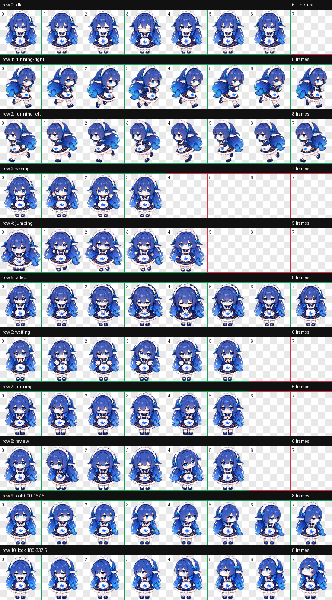

# 吃白饭的大肥鱼 · Codex Pet Plugin

把蓝发女仆小鱼“吃白饭的大肥鱼”添加到 Codex。宠物采用 v2 动画图集，包含九类标准动画和十六个顺时针注视方向。



## 通过 Codex 插件安装

```powershell
codex plugin marketplace add Gnt191612/rice-eating-fat-fish-codex-plugin
```

然后在 Codex 中打开 `/plugins`，从“吃白饭的大肥鱼”来源安装插件，开启一个新任务并输入：

```text
安装吃白饭的大肥鱼
```

安装完成后重启或刷新 Codex，在宠物选择器中选择“吃白饭的大肥鱼”。

## 克隆后直接安装

Windows PowerShell：

```powershell
git clone https://github.com/Gnt191612/rice-eating-fat-fish-codex-plugin.git
cd rice-eating-fat-fish-codex-plugin
powershell -ExecutionPolicy Bypass -File .\skills\install-fat-fish\scripts\install.ps1
```

macOS / Linux：

```bash
git clone https://github.com/Gnt191612/rice-eating-fat-fish-codex-plugin.git
cd rice-eating-fat-fish-codex-plugin
sh ./skills/install-fat-fish/scripts/install.sh
```

安装器不会静默覆盖不同版本；明确需要替换时，在 Windows 添加 `-Force`，在 macOS/Linux 添加 `--force`。

## 文件结构

```text
plugin.json                         可移植 Agent Plugin 清单
.codex-plugin/plugin.json           Codex 兼容清单
.agents/plugins/marketplace.json    GitHub/本地 marketplace 入口
skills/install-fat-fish/            安装技能与跨平台脚本
assets/pet/                          可直接使用的宠物包
assets/preview/                      动画预览
```

宠物规格：`spriteVersionNumber: 2`，RGBA WebP，1536×2288，8×11 单元格，每格 192×208。

## License

代码、文档与随仓库分发的宠物资源使用 [MIT License](LICENSE)。发布者应确保自己有权分发所使用的视觉参考及衍生资源。

---

## English

This repository packages the Codex v2 animated pet **吃白饭的大肥鱼**. Install the plugin, start a new task, and ask Codex to `安装吃白饭的大肥鱼`, or run the platform-specific installer directly. The installer copies the bundled `pet.json` and `spritesheet.webp` into the current user's Codex pets directory and never overwrites a different version without an explicit force flag.
